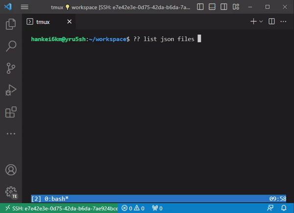

# helper-gh-copilot-cli

GitHub Copilot for CLI が生成したコマンドを利用するための Bash 用ヘルパー関数。

A Bash helper function for using the command generated by GitHub Copilot for CLI.

- 実行前に事前編集
- shellcheck によるチェック

- Pre-edit before run
- Check by shellcheck

## Usage

```sh
source helper-gh-copilot-cli.sh
```

コマンドラインで `?? list json files` のように入力した後、`Ctrl` + `a` を押下すると GitHub Copilot for CLI が開始される。

After entering `?? list json files` on the command line, press `Ctrl` + `a` to start GitHub Copilot for CLI.


